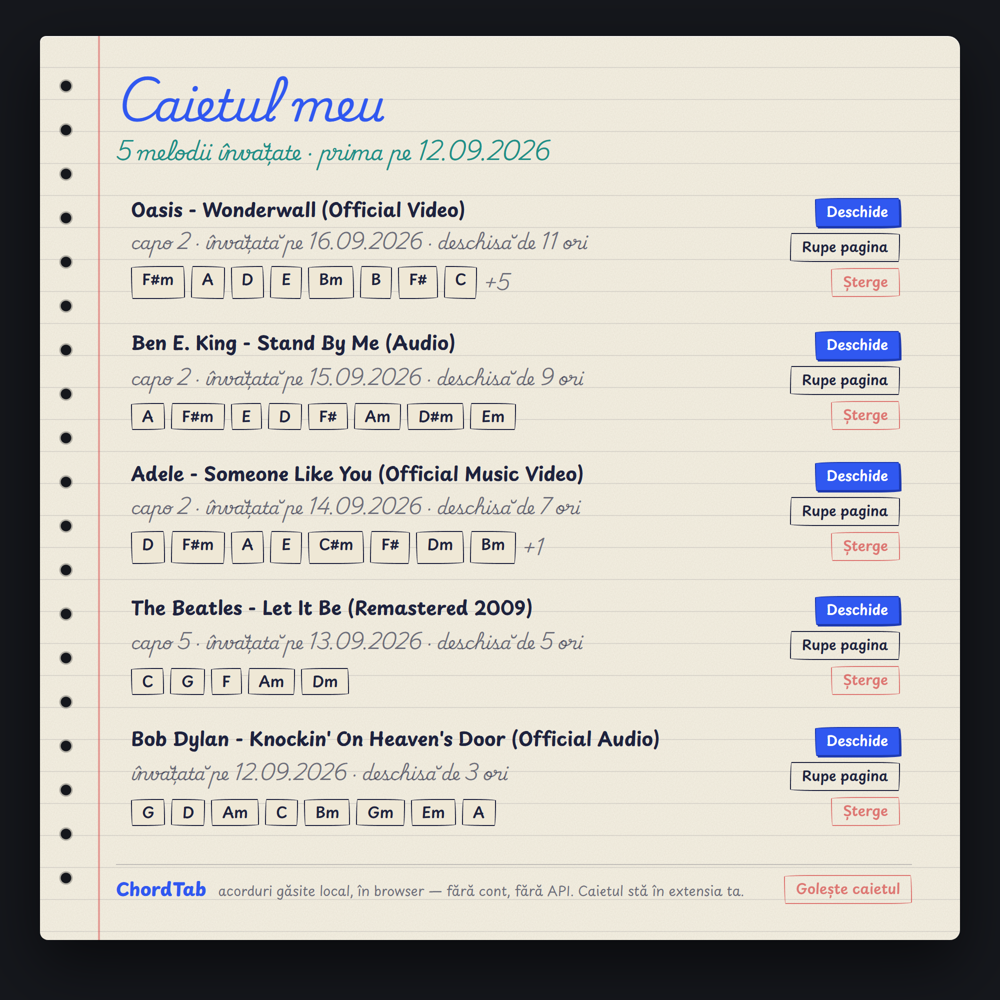

# ChordTab: acorduri de chitară pentru YouTube

Extensie Chrome care ascultă melodia din tabul de YouTube **local, în browserul tău**
(zero servere, zero chei API, zero costuri) și îți arată acordurile venind pe o bandă
sincronizată cu melodia, cu diagrame pe corzi, exersare pe secțiuni, capo și transpoziție.

**Versiunea curentă: 0.6.0**, cu tema „Caiet de cântece” (hârtie, scris de mână cu diacritice
românești), **Caietul meu** (cuprinsul melodiilor învățate) și **„Rupe pagina”** (foaia
melodiei salvată ca imagine). Arhiva e la [Releases](https://github.com/andreitrandaf1982-glitch/chordtab/releases/latest).

## Cum se folosește, în două mișcări


**Pasul 1**: deschizi melodia, dai play și apeși **iconița ChordTab** din bara Chrome (sau
Alt+Shift+C). Chrome cere gestul ăsta o dată pe tab, ca să lase extensia să asculte; după
aceea e de ajuns butonul „Analizează” din panou. Extensia ascultă și scoate acordurile; poți
cânta pe ele din prima. **Pasul 2**: când melodia se termină, analiza se oprește **singură**
și panoul se schimbă: bandă, structură, foaie, exersare. A doua oară melodia se deschide gata
învățată.

Panoul îți spune mereu în ce pas ești, iar butonul portocaliu **„Cum se folosește”** deschide
povestea întreagă, oricând.


Acordul curent, diagrama lui pe corzi și ce urmează, sincronizat cu melodia.


Când melodia are capo, îți spune unde să-l pui ca să cânți forme deschise: „Wonderwall” sună
F#m A E B, dar cu capo 2 cânți Em G D A. Bara albastră din diagramă e capodastrul.


**Banda rulantă**: acordurile curg spre linia „acum”, cu lățimea proporțională cu cât ține
fiecare, deci vezi și ritmul, nu doar ordinea. Dedesubt, benzile secțiunilor: vezi „Refren”
venind. Sub ea, **structura melodiei**, găsită singură din repetiții, și **foaia melodiei**:
cântecul întreg, un rând per secțiune, în ordine. Click pe orice acord te duce exact acolo.
Melodiile fără structură clară primesc tot o foaie, cu toate acordurile.


**Exersare**: apeși ⟳ pe refren și îl pui pe repetat, încetinit la 0,75× sau 0,5× **fără să
se schimbe tonalitatea**. Îl cânți până iese, apoi „Gata” te readuce la viteza dinainte.



**Caietul meu**: iconița-caiet din antetul panoului deschide cuprinsul melodiilor pe care
le-ai învățat: titlu, acordurile cele mai cântate, capo, data, de câte ori ai deschis-o.
E caietul cu acorduri din copilărie, doar că se scrie singur. **„Rupe pagina”** salvează
foaia oricărei melodii ca imagine, în același stil de caiet; **„Copiază”** o pune ca text în
clipboard.

## Instalare

1. Descarcă `chordtab-0.6.0.zip` de la [Releases](https://github.com/andreitrandaf1982-glitch/chordtab/releases/latest)
   și **dezarhiveaz-o** într-un folder pe care îl păstrezi (dacă ștergi folderul, dispare și extensia).
2. Deschide `chrome://extensions` și pornește **Developer mode** (colț dreapta-sus).
3. Apasă **Load unpacked** și alege folderul dezarhivat.
4. Prinde iconița în bară (click pe puzzle → pin), ca s-o ai la îndemână.

**Cum se folosește:** deschide o melodie pe YouTube, dă play și apasă **iconița ChordTab**
din bara de sus (sau Alt+Shift+C). Prima dată pe un tab, Chrome cere gestul ăsta ca să lase
extensia să asculte tabul; panoul de sub video îți spune și el. Apoi, la melodiile următoare
din același tab, e de ajuns butonul **„Analizează”** din panou. Extensia ascultă și afișează
acordurile. **Când melodia se termină, analiza se oprește singură** și apar banda rulantă,
structura și exersarea. Acordurile rămân memorate: a doua oară melodia se deschide gata
învățată.

Nu-ți cere cont, nu-ți cere nicio cheie și nu trimite nimic nicăieri. Sunetul e analizat local.

Vrei să umbli în cod? Tot ce face extensia e în folderul [`extension/`](extension/); îl poți
încărca direct cu **Load unpacked**.

## Cum funcționează

Sunetul tabului e preluat cu `chrome.tabCapture` și analizat într-un document offscreen:

```
cadru audio → FFT → vârfuri spectrale (interpolate) → chroma (12 clase) → netezire → acord
```

Netezirea e partea care face rezultatul citibil: un cadru durează 170 ms, adică o clipă, nu un
acord; judecat singur, urmărește ce se aude mai tare atunci. Mediem chroma pe ~1,2 s, cerem
unui acord nou să se țină ~0,45 s înainte să-l afișăm, și folosim **nota de bas** ca să stabilim
fundamentala (altfel un Sol cu un Fa# trecător se confundă cu un Si minor).
Măsurat pe semnal ostil: **28% → 97% acuratețe, 51 → 4 schimbări**.

Pe melodii reale intrușii sunt aproape toți **rude** ale acordului care sună (Am în loc de A,
Em lângă G): o rudă trebuie să țină mai mult și să bată clar scorul acordului comis ca s-o
credem. Ce rămâne scurt și rar se curăță înainte de structură și de foaie.

Totul e cod propriu, fără biblioteci externe și fără WebAssembly. Nimic nu părăsește browserul.

## Ce face, pe scurt

- **Ghid în panou**: linia „Pasul N din 2” spune mereu ce se întâmplă și ce urmează; butonul
  portocaliu „Cum se folosește” deschide instrucțiunile întregi. Analiza se încheie singură
  la finalul melodiei, iar autoplay-ul YouTube nu mai fură panoul: melodia rămâne pe pauză,
  la început, gata de cântat.
- **Tema „Caiet de cântece”**: panoul e o pagină de caiet, hârtie cu linii, scotch, titluri
  scrise de mână (Playwrite RO, cursivul școlii românești), acorduri cu litere de copil
  (Playpen Sans). Fonturile sunt în extensie, cu Ș, Ț, Â, Ă, Î corecte.
- **Caietul meu**: cuprinsul melodiilor învățate, cu „Deschide”, „Rupe pagina” și „Șterge”.
- **Rupe pagina / Copiază**: foaia melodiei ca imagine PNG sau ca text.
- **Banda rulantă**: acordurile vin spre linia „acum”, late cât țin de mult. Click pe oricare
  te duce acolo. Cu „mișcare redusă” pornită în sistem, banda nu curge: sare la fiecare acord.
- **Diagrama pe corzi** a acordului curent, mereu vizibilă; hover pe unul care urmează ți-o arată
  pe a lui.
- **Exersare**: o secțiune pe repetat, la 0,5× / 0,75× / 1×, fără schimbarea tonalității.
- **Structura melodiei**: strofă, refren, punte, găsite din repetiții. Îți arată și în ce
  secțiune ești acum.
- **Foaia melodiei**: cântecul întreg, un rând per secțiune, cu acordurile pe care poți da
  click ca să sari exact acolo. Acordul care sună acum e aprins.
- **Capo**: îți spune pe ce poziție să-l pui ca să cânți forme deschise, și îți arată formele.
- **Transpoziție** ±6 semitonuri, dacă vrei să cânți în altă tonalitate.
- **Memorie per melodie**: a doua oară acordurile apar instant și perfect sincronizate.

## Limitări oneste

- Detectează acordurile **principale** (majore și minore); nu transcrie solo-uri sau tabs
  notă-cu-notă. Acuratețea scade pe mixuri foarte dense.
- Prima analiză se face în timp ce melodia se redă; rezultatul se salvează per video.
- La viteze de redare diferite de 1x sincronizarea rămâne corectă, dar calitatea detecției scade.
- Presupune **acordaj standard**. Acordajele coborâte (drop D și rudele lui) n-ar putea fi
  ghicite din sunet oricum: basul cântă în același registru, deci n-am avea cum să deosebim o
  chitară coborâtă de un bas obișnuit.

## Depanare

Dacă ceva nu merge, pornește **Debug logging** din pagina de opțiuni a extensiei
(`chrome://extensions` → ChordTab → *Detalii* → *Opțiuni extensie*) și deschide consola.
Toate mesajele încep cu `[ChordTab:...]`, deci le poți filtra scriind `ChordTab`.

Tot de acolo poți **goli memoria de acorduri**, dacă vrei să reanalizezi totul de la zero.

## Licență

[MIT](LICENSE).
