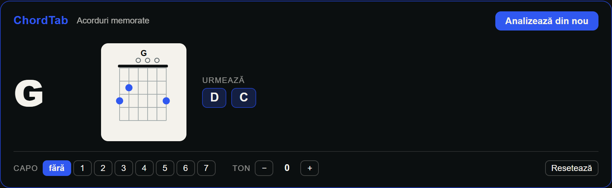
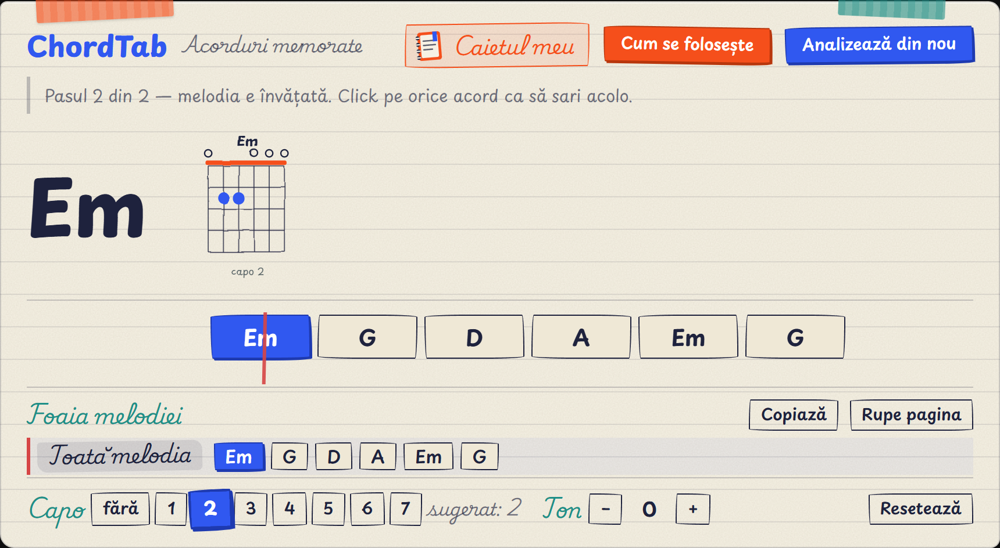
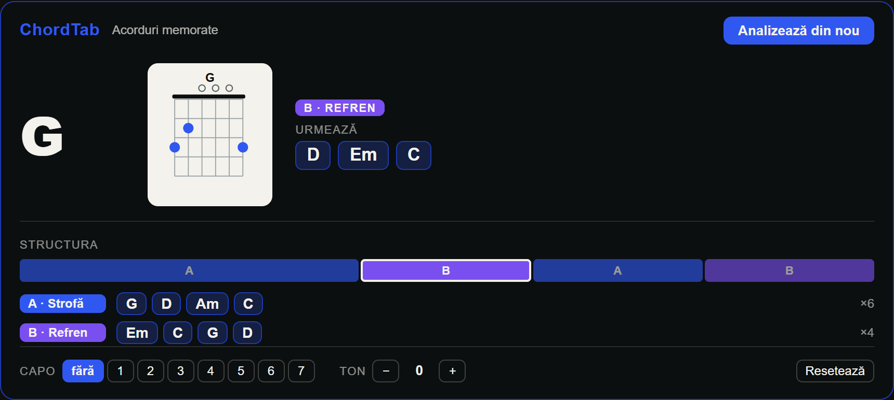

# ChordTab — acorduri de chitară pentru YouTube

Extensie Chrome care ascultă melodia din tabul de YouTube **local, în browserul tău**
(zero servere, zero chei API, zero costuri) și afișează acordurile principale sincronizate
cu redarea — cu diagrame la hover, sugestie de capo și transpoziție.

**Stare:** Etapa 1 completă + structura melodiei (v0.2.0).
Planul complet: [docs/PLAN-guitar-chords-extension.md](docs/PLAN-guitar-chords-extension.md) ·
Ce e de verificat: [docs/VERIFICARE.md](docs/VERIFICARE.md)



Acordul curent, diagrama lui pe corzi și ce urmează — sincronizat cu melodia.



Când melodia are capo, îți spune unde să-l pui ca să cânți forme deschise: „Wonderwall" sună
F#m A E B, dar cu capo 2 cânți Em G D A. Bara albastră din diagramă e capodastrul.



**Structura melodiei**, găsită singură din repetiții: bara arată unde e strofa și unde e
refrenul (click pe un segment = sari acolo), iar legenda îți dă tiparul fiecărei secțiuni
**o singură dată** — „Strofă: G D Am C, de 6 ori" — în loc de un șir nesfârșit de acorduri.

## Instalare

1. Descarcă arhiva (`chordtab-x.y.z.zip`) și **dezarhiveaz-o** într-un folder pe care îl păstrezi.
2. Deschide `chrome://extensions` și pornește **Developer mode** (colț dreapta-sus).
3. Apasă **Load unpacked** și alege folderul dezarhivat.
4. Prinde iconița în bară (click pe puzzle → pin), ca s-o ai la îndemână.

**Cum se folosește:** deschide o melodie pe YouTube, dă play, apasă iconița. Extensia ascultă
și afișează acordurile sub video. Când ai terminat, apasă din nou — acordurile rămân memorate,
iar a doua oară apar instant, sincronizate exact.

Nu-ți cere cont, nu-ți cere nicio cheie și nu trimite nimic nicăieri. Sunetul e analizat local.

### Pentru dezvoltare

```bash
git clone https://github.com/andreitrandaf1982-glitch/chordtab
cd chordtab && npm install
npx playwright install chromium   # pentru testele din browser
npm test
npm run build                     # produce dist/chordtab-x.y.z.zip
```

Încarcă direct folderul `extension/` cu **Load unpacked**.

## Teste

```bash
npm install
npx playwright install chromium   # o singură dată, pentru testul din browser
npm test
```

| Test | Ce verifică |
|---|---|
| `tests/music-theory.test.mjs` | transpoziție, parsare de acorduri, calculul capo-ului |
| `tests/chord-detection.test.mjs` | lanțul FFT → chroma → acord, pe acorduri sintetizate, la 44100 și 48000 Hz |
| `tests/progression.test.mjs` | urmărirea schimbărilor de acord în timp, pe o progresie |
| `tests/stability.test.mjs` | acuratețe și stabilitate pe semnal ostil (melodie + percuție) |
| `tests/diagrams.test.mjs` | fiecare digitație, verificată **muzical**: ce note ies din corzi |
| `tests/sections.test.mjs` | detecția structurii: bucle, secțiuni, nume, zgomot, cazuri limită |
| `tests/browser-selftest.mjs` | extensia într-un Chromium real, sub CSP-ul MV3, plus logging |
| `tests/ui.test.mjs` | panoul, memoria, capo, transpoziția și diagramele — în browser real |
| `tests/package.test.mjs` | arhiva dezarhivată și încărcată ca un utilizator (`npm run test:package`) |

`npm run test:unit` sare peste testul din browser dacă nu vrei să aștepți.

## Cum funcționează

Sunetul tabului e preluat cu `chrome.tabCapture` și analizat într-un document offscreen:

```
cadru audio → FFT → vârfuri spectrale (interpolate) → chroma (12 clase) → netezire → acord
```

Netezirea e partea care face rezultatul citibil: un cadru durează 170 ms, adică o clipă, nu un
acord — judecat singur, urmărește ce se aude mai tare atunci. Mediem chroma pe ~1,2 s, cerem
unui acord nou să se țină ~0,45 s înainte să-l afișăm, și folosim **nota de bas** ca să stabilim
fundamentala (altfel un Sol cu un Fa# trecător se confundă cu un Si minor).
Măsurat pe semnal ostil: **28% → 97% acuratețe, 51 → 4 schimbări**.

Totul e cod propriu, fără biblioteci externe și fără WebAssembly. Nimic nu părăsește browserul.

> Prima variantă folosea [essentia.js](https://github.com/MTG/essentia.js). Trecea toate testele
> în Node, dar nu poate rula într-o extensie Manifest V3 — povestea completă e în
> [docs/BUG-essentia-mv3-csp.md](docs/BUG-essentia-mv3-csp.md). Merită citită dacă te
> interesează de ce un test verde nu înseamnă întotdeauna cod care merge.

## Ce face, pe scurt

- **Acordurile sincronizate** cu melodia, sub video, cu ce urmează la vedere.
- **Diagrama pe corzi** a acordului curent, mereu vizibilă; hover pe unul care urmează ți-o arată
  pe a lui.
- **Structura melodiei**: strofă, refren, punte — găsite din repetiții, cu tiparul fiecăreia
  afișat o singură dată și cu salt la click. Îți arată și în ce secțiune ești acum.
- **Capo**: îți spune pe ce poziție să-l pui ca să cânți forme deschise, și îți arată formele.
- **Transpoziție** ±6 semitonuri, dacă vrei să cânți în altă tonalitate.
- **Memorie per melodie**: a doua oară acordurile apar instant și perfect sincronizate.

## Limitări oneste

- Detectează acordurile **principale** (majore și minore); nu transcrie solo-uri sau tabs
  notă-cu-notă. Acuratețea scade pe mixuri foarte dense.
- Prima analiză se face în timp ce melodia se redă; rezultatul se salvează per video.
- La viteze de redare diferite de 1x sincronizarea rămâne corectă, dar calitatea detecției scade.
- Presupune **acordaj standard**. Acordajele coborâte (drop D și rudele lui) n-ar putea fi
  ghicite din sunet oricum: basul cântă în același registru, deci n-am avea cum să deosebim o
  chitară coborâtă de un bas obișnuit.
- Upgrade posibil în viitor: analiză de precizie printr-un API plătit (ex. Klangio),
  cu cheia securizată printr-un backend (Supabase Edge Functions) — neinclus în această versiune.

## Depanare

Dacă ceva nu merge, pornește **Debug logging** din pagina de opțiuni a extensiei
(`chrome://extensions` → ChordTab → *Detalii* → *Opțiuni extensie*) și deschide consola.
Toate mesajele încep cu `[ChordTab:...]`, deci le poți filtra scriind `ChordTab`.

Tot de acolo poți **goli memoria de acorduri**, dacă vrei să reanalizezi totul de la zero.

## Licență

[MIT](LICENSE).
