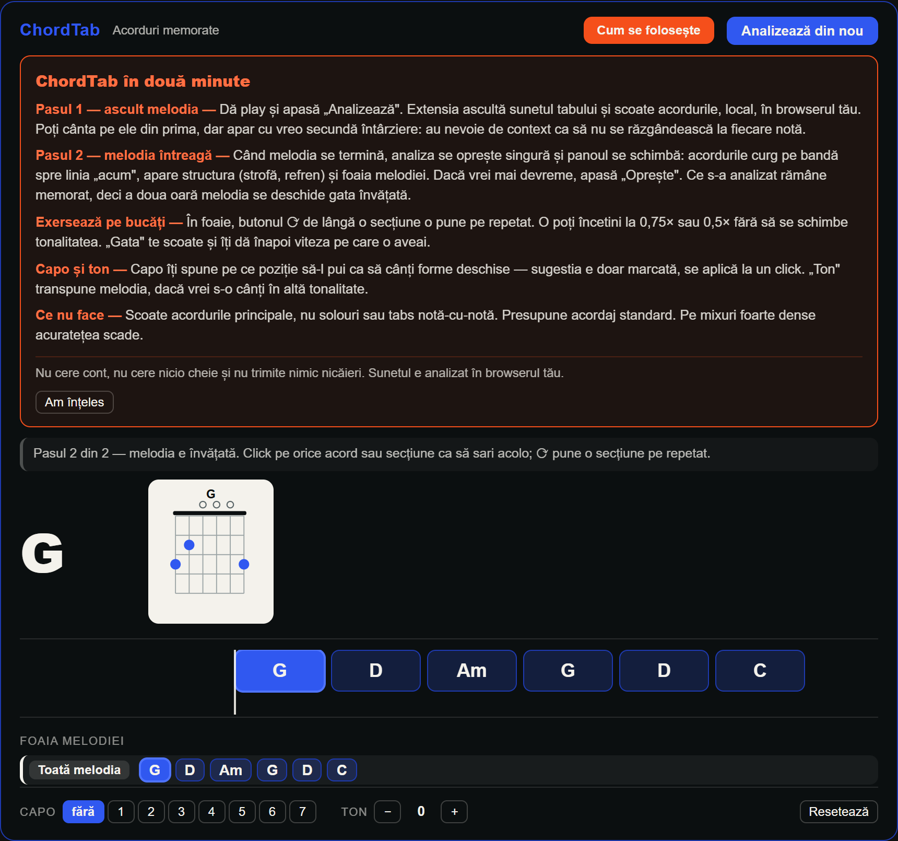
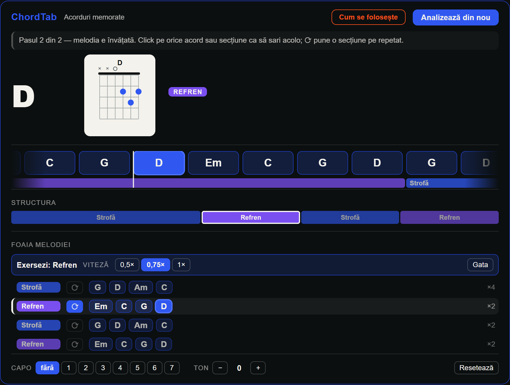

# Verificare în Chrome — **v0.5.0: extensia își explică singură ce face**

Document viu: descrie mereu ce e de verificat ACUM.

---

## Ce e nou în v0.5.0 (reparația defectului pe care l-ai găsit)

Ai spus: „dacă nu dau reload, nu mai apare chestia aia frumoasă… gândește-te că asta e pentru
cineva care o să testeze extensia la concurs și să înțeleagă ce are de făcut”. Aveai dreptate,
și era un defect de fond, nu de explicație: cine lăsa melodia să se termine rămânea la
nesfârșit în faza de analiză, cu acorduri care trec și nimic altceva.

Reparat pe trei niveluri:

**1. Nu mai trebuie să dai reload deloc.** Când melodia se termină, analiza **se oprește
singură** și panoul trece de la sine în faza a doua: bandă, structură, foaie, exersare.

**2. Panoul îți spune mereu unde ești.** O linie sub antet, portocalie cât timp ai ceva de
aflat: „Pasul 1 din 2 — învăț melodia (24 de acorduri până acum). Poți cânta pe acordurile de
mai jos. Când melodia se termină, trec singură la Pasul 2.” În faza a doua devine discretă.

**3. Butonul portocaliu „Cum se folosește”** — instrucțiunile întregi, oricând.

Se deschide **singur prima oară**, ca cineva care tocmai a instalat extensia să nu fie nevoit
să ghicească. După „Am înțeles" nu mai insistă, dar butonul rămâne acolo. Culoarea e portocaliul
**#F54F1B** din brandul tău Not a Coder — l-am luat din biblioteca ta de brand, nu l-am inventat.

### Ce te rog să verifici la asta

1. **Prima probă, cea importantă:** pornește o analiză pe o melodie **scurtă** și las-o să
   se termine **fără să apeși nimic**. Trebuie să treacă singură în Pasul 2.
2. **Linia pasului** — în timpul analizei spune „Pasul 1 din 2" și numără acordurile găsite?
3. **„Cum se folosește"** — se deschide, se citește, „Am înțeles" îl închide?
4. Reîncarcă pagina — ghidul **nu** mai trebuie să se deschidă singur, dar butonul e acolo.

---

## Ce era nou în v0.4.0

Feedbackul tău pe v0.3.0 a fost: „pare contra-intuitivă, greoaie, nu face mai mult decât să
arate acorduri static… foaia pare învechită. VREAU MULT MAI MULT CALITATIV.” Astea sunt
răspunsurile.

### 1. Numele secțiunilor, pe românește

„A · liber / B / C” era limbaj de laborator. Acum scrie **Intro, Strofă, Refren, Punte,
Final** — iar acolo unde extensia nu e sigură ce e o bucată, scrie **„Partea 1”, „Partea 2”**,
numerotate în ordinea în care le auzi. Același grup are același număr oriunde revine. Litera
n-a dispărut, doar s-a mutat în interior, unde ține culorile.

### 2. Banda rulantă — asta înlocuiește lista de trei acorduri

Acordurile **curg spre linia albă „acum”**, ca la karaoke. Fiecare cartonaș e **lat cât ține
acordul**, deci se citește și ritmul, nu doar ordinea: vezi din privire că refrenul stă două
măsuri pe Em și apoi trece repede prin C și G.

Dedesubt curge și **banda secțiunii**, cu numele scris în ea — vezi „Refren” venind, nu doar
acordurile lui. Click pe orice cartonaș te duce acolo.

### 3. Modul de exersare — pentru mine, ăsta e saltul

În foaie, fiecare secțiune are acum un buton **⟳**. Apeși pe cel de la refren și:

- refrenul intră **pe repetat** — se cântă la nesfârșit, până spui tu stop;
- îl poți **încetini la 0,75× sau 0,5×, fără să se schimbe tonalitatea** (acordurile afișate
  rămân exact acordurile pe care le auzi — asta e partea la care conta să nu greșim);
- **„Gata”** te scoate și îți pune înapoi **viteza pe care o aveai tu înainte**, nu 1 orbește;
- dacă sari singur în altă parte a melodiei, exersarea se oprește — ai plecat intenționat.

---

## Ce te rog să verifici

Reload la extensie (`chrome://extensions` → ChordTab → săgeata circulară), apoi pe o melodie
deja memorată:

1. **Banda** — acordurile vin spre linia albă și cel de sub ea e chiar ce se aude?
2. **Lățimile** — un acord care ține mult e vizibil mai lat decât unul scurt?
3. **⟳ pe refren** — sare la începutul lui și îl repetă la nesfârșit?
4. **0,75×** — melodia e mai lentă, dar **nu mai gravă**? (asta e proba care contează)
5. **„Gata”** — te scoate din buclă și revine la viteza dinainte?
6. **Numele** — vezi „Strofă / Refren” sau „Partea 1 / Partea 2”, nicăieri „A ·” sau „B ·”?
7. **Click pe un acord de pe bandă** — te duce fix acolo?

Și una pentru cei cu setări de accesibilitate: dacă pornești **„mișcare redusă”** în Windows
(Setări → Accesibilitate → Efecte vizuale → Efecte de animație oprit), banda nu mai trebuie să
curgă continuu — sare o dată, la fiecare schimbare de acord. Restul funcționează la fel.

---

## Ce am renunțat să facem, și de ce

**Profesorul AI pe Gemini Nano** — respins de tine, cu dreptate: fiecare utilizator ar fi
trebuit să descarce 2–4 GB și să aibă o placă video peste cerințe. Ar fi fost invizibil exact
pentru oamenii din comunitate și din juriu. Proba construită pentru el a fost scoasă complet.

**Extensia te ascultă cântând la microfon** — respinsă tot de tine: chitările amatorilor sunt
des dezacordate, iar un verdict „greșit” ar fi părut defectul extensiei, nu al acordajului.

Amândouă sunt scrise ca decizii ferme în [planul de lucru](PLAN-banda-si-exersare.md), ca să
nu reapară.

---

## Starea proiectului

`npm test` = 46 de verificări doar în interfață, plus testele de algoritm.
`npm run test:package` verifică arhiva, inclusiv separatoarele din zip.

## Ce a rămas dinadins nereparat

Backlogul e la finalul [planului](PLAN-banda-si-exersare.md) și al
[celui de reparații](PLAN-reparatii-audit.md): pagina de opțiuni e încă pe verdele vechi,
în timpul unei reclame panoul afișează acordul greșit (se corectează singur la final),
memoria de acorduri crește nelimitat. Toate sunt marginale.

**Urmează**, după ce încerci tu: un singur audit adversarial pe toată extensia, înainte de
trimiterea la concurs.
